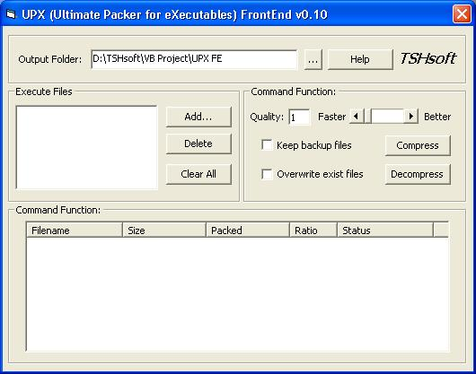



## UPX FrontEnd v0\.11 Fixed\!

### Description

UPX FrontEnd bug fixed! Now can 100% working correctly! Can compress and decompress executable files. Enjoy it!
 
### More Info
 

             |
---                |---
**Submitted On**   |2005-10-31 23:00:02
**By**             |[TSHsoft](https://github.com/Planet-Source-Code/PSCIndex/blob/master/ByAuthor/tshsoft.md)
**Level**          |Beginner
**User Rating**    |5.0 (10 globes from 2 users)
**Compatibility**  |VB 5\.0, VB 6\.0
**Category**       |[Coding Standards](https://github.com/Planet-Source-Code/PSCIndex/blob/master/ByCategory/coding-standards__1-43.md)
**World**          |[Visual Basic](https://github.com/Planet-Source-Code/PSCIndex/blob/master/ByWorld/visual-basic.md)
**Archive File**   |[UPX\_FrontE1944871112005\.zip](https://github.com/Planet-Source-Code/tshsoft-upx-frontend-v0-11-fixed__1-63094/archive/master.zip)

